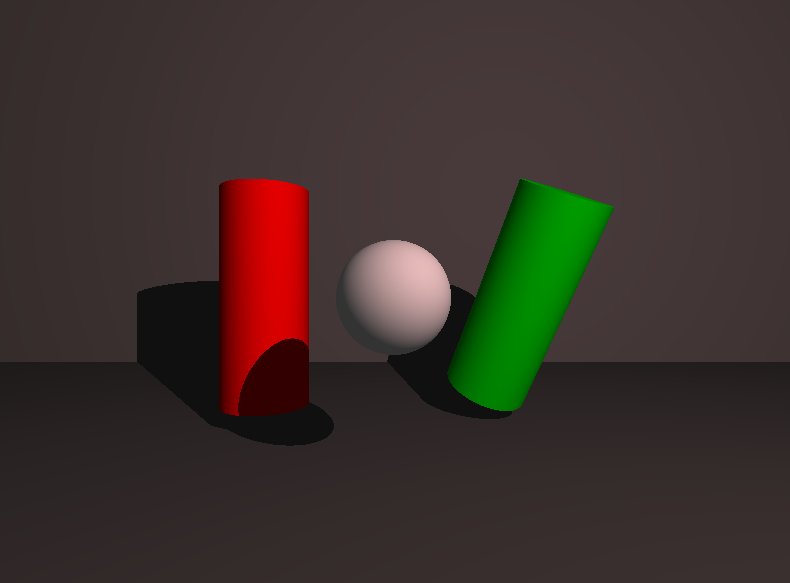
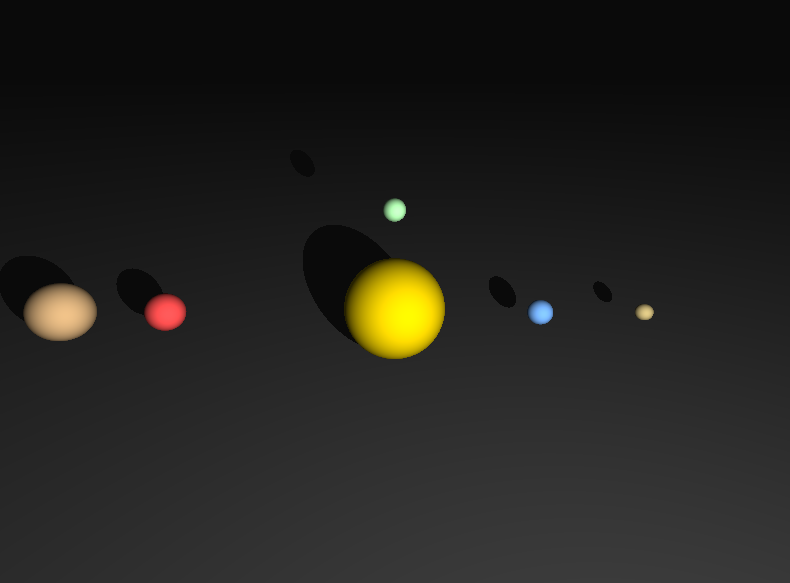
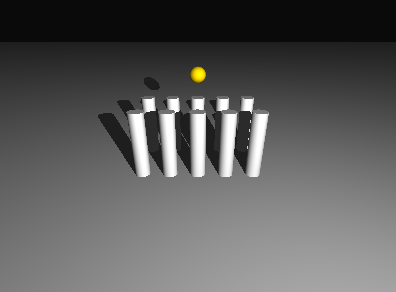
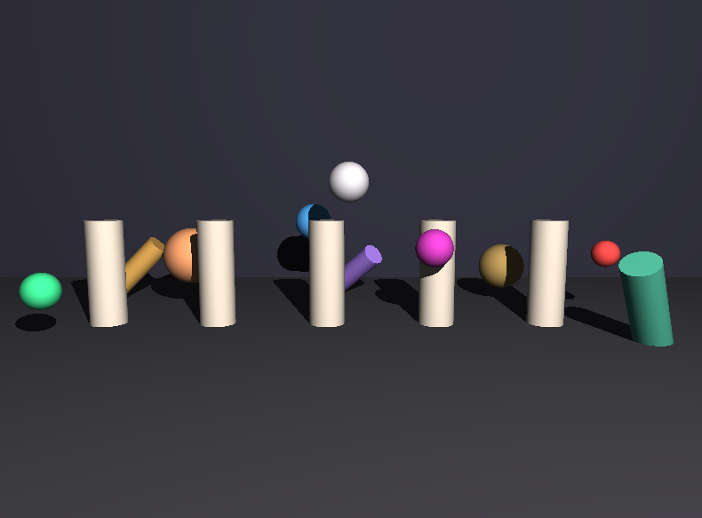

*This project has been created as part of the 42 curriculum by anfouger.*

# Mini-RT

A minimal ray tracer developed as part of the 42 curriculum.

## 📖 Description

miniRT is an introduction to **computer graphics** through the implementation of a **ray tracer** from scratch in **C** using the MiniLibX graphical library.

The goal of the project is to simulate how **light** interacts with **simple geometric objects** by **casting rays** from a virtual camera into a 3D scene. For **each pixel** displayed on the screen, **a ray is generated** and tested against the objects present in the scene to **determine what should be visible**.

#### The mandatory part of the project supports:

* Spheres
* Planes
* Cylinders
* Ambient lighting
* Diffuse lighting (Lambertian reflection)
* Hard shadows
* Scene parsing from `.rt` files

#### The project provides a practical introduction to:

* Vector mathematics
* Geometric intersections
* Surface normals
* Lighting models
* 3D scene representation
* Rendering pipelines


## 🎯 What is Ray Tracing?

Ray tracing is a rendering technique used to generate **realistic images** by **simulating the path of light**.

Instead of drawing objects directly on the screen, the renderer **sends rays** from the camera **through each pixel** of the image.

For every ray:

1. Find the closest **object intersection**.
2. Compute the **surface normal** at the **hit point**.
3. Evaluate the **lighting** at that point.
4. Determine the final **color of the pixel**.

This process is **repeated for every pixel** of the image.

Although the implementation in miniRT is **intentionally simple**, it introduces many of the same concepts used in modern rendering engines and CGI software.

## ✨ Features

### Objects

* Sphere intersection
* Plane intersection
* Finite cylinder intersection
* Cylinder caps (top and bottom disks)

### Lighting

* Ambient light
* Diffuse light
* Hard shadows

### Scene Management

* Scene parsing from `.rt` files
* Camera positioning
* Camera orientation
* Light positioning
* Object transformations

### User Controls

* ESC to quit the program
* Window close button support
* w - s - a - d to move forward backward left and right
* q - e to move up and down
* p - o to pixelate or depixelate
* Directional arrow to rotate camera

## 📸 Gallery

### Exposition Room



### Solar System Scene



### Greek Temple Scene



### Stress Test Scene




## 🛠️ Instructions

### Requirements

* Linux
* GCC
* Make
* MiniLibX

### Compilation

```bash
make
```

### Launch

```bash
./miniRT scene.rt
```

### Example

```bash
./miniRT scenes/greek_temple.rt
```

## 📂 Scene Format

miniRT uses scene description files with the `.rt` extension.

Example:

```text
A 0.2 255,255,255

C 0,0,20 0,0,-1 70

L 20,30,20 0.8 255,255,255

pl 0,-15,0 0,1,0 150,150,150

sp 0,0,-40 20 255,0,0

cy 20,0,-60 0,1,0 10 30 0,255,0
```


## 🧠 Technical Overview

The renderer is based on the following pipeline:

```text
Camera
   │
   ▼
Generate Ray
   │
   ▼
Find Closest Intersection
   │
   ▼
Compute Surface Normal
   │
   ▼
Evaluate Lighting
   │
   ▼
Render Pixel
```

### Mathematical Concepts

#### The project relies heavily on:

* Vector addition and subtraction
* Dot products
* Vector normalization
* Ray equations
* Plane intersections
* Sphere intersections
* Cylinder intersections
* Projection onto an axis
* Lambert's cosine law


## 🤖 AI Usage

Artificial intelligence was used as a learning and documentation assistant during the development of this project.

Its primary role was to help understand and reason about the mathematical concepts involved in ray tracing, including:

* Vector mathematics
* Ray-object intersections
* Surface normal computation
* Cylinder geometry
* Lighting calculations
* General rendering concepts

The implementation, debugging, architecture decisions, and final code were developed and integrated by the project author.

AI was used as an educational resource comparable to technical documentation, tutorials, and explanatory articles.


## 📚 Resources

### Mathematics

* [Khan Academy](https://fr.khanacademy.org/)

### Ray Tracing

* [How does Ray Tracing Work in Video Games and Movies? - Branch Education](https://www.youtube.com/watch?v=iOlehM5kNSk)


## 🚀 Possible Extensions

Some common ray tracing extensions include:

* Multiple light sources
* Colored lighting
* Reflections
* Refractions
* Anti-aliasing
* Texture mapping
* Specular highlights
* Soft shadows
* Bounding volume acceleration structures (BVH)

These features are intentionally outside the scope of the mandatory project but represent natural next steps for further exploration.
